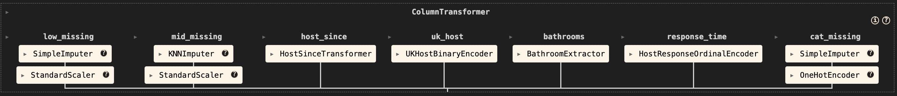

# Predicting and Optimizing Airbnb Pricing Strategies for AirBnB Listings in Bristol, UK
---

## 📌 Overview
This project uses the 2019 **Bristol, UK Airbnb listings dataset** to predict `reviews_per_month` — a proxy for listing popularity.  
The goal is to understand what factors drive guest engagement and how Airbnb hosts can optimize their listings to increase popularity and forecast success for new properties.

The dataset contains features such as:

- **Listing ID, host details, neighbourhood, location coordinates, room type, price, minimum nights, number of reviews, availability**, etc.
- For example:
  - **neighbourhood_group** reflects location desirability
  - **room_type** affects guest preferences
  - **price** influences booking decisions
  - **availability_365** impacts the likelihood of receiving reviews

Feature relevance is validated through **Exploratory Data Analysis (EDA)** and **model interpretation techniques** such as **SHAP values** and **feature importance**.

This project blends **EDA**, **feature engineering**, and **multiple machine learning models** to produce both regression and classification predictions.

---

## Running the App

***WARNING: By this point you should have the virtual environment installed. If not proceed back to the main page and follow the instructions.***


1. Clone the full project

2. Activate the conda environment and Navigate to app.py in deploy directory
```
python deploy/app.py
```
The server will start at:
http://localhost:3000

**Input format**: Refer to deploy/payload.json for an example of the correct feature types.

## Data

The data source can be found [here](https://insideairbnb.com/get-the-data/)

The raw dataset has shape (2772, 79)

### Cleaning and filtering

During the preprocessing step, I have dropped many features before splitting the dataset, these are:
- Highly irrelevant features
- Features with minimum variation (features that have the same value across all samples)
- Features with missing values (more than 80%)
- Highly correlated features (more than .9 correlation)
- Features with high cardinality and low signal
- Data leaking or potentially leaking features

I then proceeded to drop samples, which can help training time, by eliminating samples with:

- High number of missing values (threshold at .8)
- Remove duplicated samples
- Drop samples with missing target value (price)
- Instead of dropping outliers, we capped the extreme outliers of features (winsorization)
- Price with greater than 99% of the samples

### Transformations and splitting

Data type transformation is applied before test/train split by striping the dollar sign and converting price in dollars (string) to int

Test/train split is performed by 0.3/0.7

### Preprocessing strategy

During the preprocessing step, I have applied 3 different strategies to handle NaN values for numerical features:

1. For features with low level of missingness (less than .1) I have imputed the median
2. For features with medium level of missingness (between .3 and .1), KNNImputer fills in the gaps using the average of the values from the 5 most similar samples by euclidean distance
3. For the remaining features, it is dropped.

For NaNs in categorical features, I have imputed *unknown* 

I have developed custom transformers to extract useful data:

- `HostSinceTransform`: Transform `host_since` feature to date time format and extract, day of month, month, and year
- `UKHostBinaryEncoder`: OHE `host_location` feature to state whether the host resides in the UK or not (t or f)
- `BathroomExtractor`: Extracts the number of bathrooms from the `bathroom_text` feature
- `HostResponseOrdinalEncoder`: Using OrdinalEncoder on feature `host_response_time` to determine whether it is 
    - a few days or more
    - within a day
    - within a few hours
    - within an hour
    - unknown

**Note:** All preprocessing steps are implemented using scikit-learn's `Pipeline` and `ColumnTransformer` to strictly prevent data leakage and ensure consistency between training and inference. Here's the diagram:



## Models

I have decided to make this project both a classification and a regression type.

For regression part, I will be training the following models:
- sk-learn's
    - DummyRegressor as the baseline model
    - Ridge as the linear model with L2-regularization
    - RandomForestRegressor
    - DecisionTreeRegressor
- LGBMRegressor
- XGBRegressor

I will then proceed to select the best performing model and perform hyperparameter optimization to further improve performance using sk-learn's GridSearchCV or RandomizedSearchCV.

To evaluate the model's performace I will principally use R^2. But for the best and optimized model I will do further evaluation on metrics such as RMSE, MAE and MAPE.

For the classification part, I will begin to quantize or discretize each sample using interquartile binning to prevent class imbalance, then use it to train the following models:

- sk-learn's
    - DummyClassifier as the baseline model
    - LogistiRegression
    - SVC with rbf kernel
    - RandomForestClassifier
    - DecisionTreeRegressor
- LGBMClassifier
- XGBClassifier

I will also conduct hyperparameter tuning for the best classification model

Used metrics such as accuracy, precision, recall, f1 and AUC.

## Code Structure

├── data/                           # Raw and processed datasets
│   ├── listings.csv
│   ├── X_train.csv
│   ├── X_test.csv
│   ├── y_train.csv
│   ├── y_test.csv
│   └── preprocessed/
│       └── preprocessing_pipeline.pkl
│
├── deploy/                         # Deployment files for the web app
│   ├── templates/
│   │   └── index.html               # Frontend template
│   ├── app.py                       # Flask app entry point
│   └── payload.json                 # Example API payload
│
├── docs/                            # Documentation assets
│   └── preprocessing_diagram.png    # Pipeline diagram
│
├── model/                           # Trained model and schema
│   ├── final_model.pkl
│   └── raw_schema.json
│
├── AirBnB.ipynb                     # Main notebook for analysis/modeling
├── EDA.ipynb                         # Exploratory Data Analysis
├── Feature_importances.ipynb         # Feature importance analysis
├── models.ipynb                      # Model training/evaluation
├── custom_transformers.py            # Custom sklearn transformers
│
├── LICENSE
├── README.md

## Results and Evaluation
- Regression (log(y)):
    - R^2: 0.742
    - MAE: $0.21
    - RMSLE: 0.0029
    - MAPE: 0.05

- Regression (original scale):
    - R^2: 0.665
    - MAE: $21.89
    - RMSLE: 0.0832
    - MAPE: 0.22

- Classification:
    - Accuracy: .427
    - Precision: .422
    - Recall: .426
    - F1: .421
    - AUC: .832

## Future Work

Here are some of the improvements I look forward in making:
- Elevating the UX and design of the Flask app
- Apply and experiment with Deep learning models
- Add unit tests for API and pipeline
- Implement error handling in API
- Improve reproducibility of the project by using Docker, GitHub Actions and Makefile
- Better directory modularization

## License & Acknowledgments